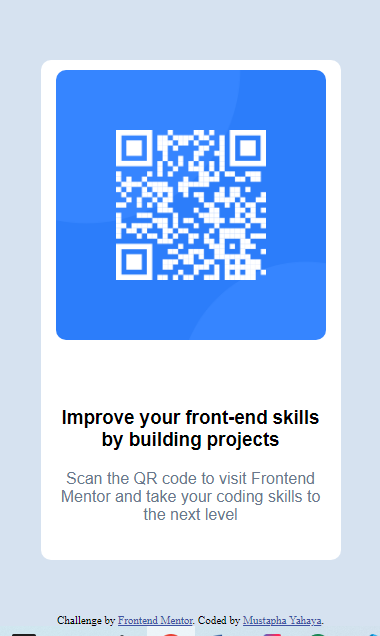
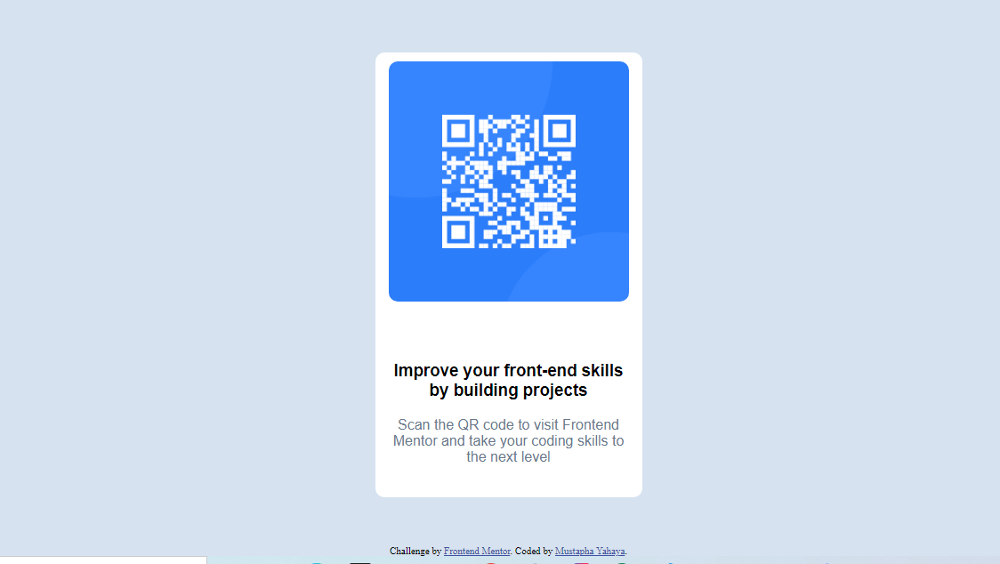

# Frontend Mentor - QR code component solution

This is a solution to the [QR code component challenge on Frontend Mentor](https://www.frontendmentor.io/challenges/qr-code-component-iux_sIO_H). Frontend Mentor challenges help you improve your coding skills by building realistic projects. 

## Table of contents

- [Overview](#overview)
  - [Screenshot](#screenshot)
  - [Links](#links)
- [My process](#my-process)
  - [Built with](#built-with)
  - [What I learned](#what-i-learned)
  - [Continued development](#continued-development)
- [Author](#author)

## Overview

### Screenshot





### Links

- Solution URL: [QR Code Component ](https://www.frontendmentor.io/challenges/qr-code-component-iux_sIO_H)
- Live Site URL: [https://mustaphayahaya.github.io/First_Project/](https://your-live-site-url.com)

## My process

### Built with

- Semantic HTML5 markup
- CSS basics properties

### What I learned

In this simple project I learn some basic ways to structure HTML5 and to position content and items in CSS and make the page responsive with just these basic.
Some code I’m proud of:
```html
<div class="caption"> 
          <h3> Improve your front-end skills by building projects</h3>
          <p>  Scan the QR code to visit Frontend Mentor and take your coding skills to the next level</p>
        </div>
```

```css
Proud_of_this{
    position: relative;
    width: 300px;
    margin: auto;
    margin-bottom: 4%;
    margin-top: 8%;
    height: 500px; 
    display: flex;
    justify-content: center; 
  }

  .img {
    position: absolute;
    top: 10px;
    display: block;
    width: 90%;
    height: auto;
    margin: auto;
    border-radius: 10px;
}
```

### Continued development

My next step is to focus on responsive technology like CSS grid and Flex, these will improve my ability to build good responsive web site.
Next after, I will focus on CSS animations. 


## Author

- Facebook - [Mustapha Yahaya](https://www.facebook.com/share/12Bx28EfB1R/?mibextid=qi2Omg)
- Frontend Mentor - [@MustaphaYahaya](https://www.frontendmentor.io/profile/MustaphaYahaya)
- Twitter - [@ibnyahayamusty]( https://x.com/ibnyahayamusty?s=08)

